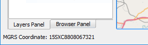
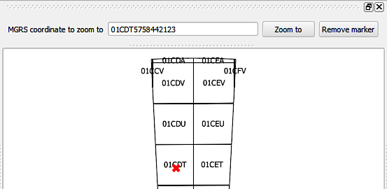

MGRS Tools
=====================

Tools to use MGRS coordinates in QGIS
-------------------------------------

The plugin contains 2 tools:

- Zoom to coordinate
- MGRS map tool

To use the map tool, select the *MGRS map tool* item in the MGRS tools menu. 

The map tool will get activated. When you now move your mouse over the QGIS map canvas, the MGRS coordinates corresponding to the mouse position will be displayed in the QGIS status bar.

The *Zoom to coordinate* tool allows you to zoom to a given MGRS coordinate. The coordinate can be a full one with a precision level of 1m, or a shorter one representing a lower precision level. Coordinates containing spaces are supported.

About the mgrs library
----------------------

The plugin uses the `mgrs library <https://github.com/hobu/mgrs>`_, which itself requires native libraries to perform the lat-lon to MGRS conversions. This repo has by default compiled libraries for working in Win32/64, Mac 10.7+ and Ubuntu 14.04 platforms. If you plan to use a different platform, you should compile the native libraries yourself and use them for installing the plugin in your QGIS plugins folder, located at::

/<user folder>/.qgis2/python/plugins/mgrstools/ext-libs/mgrs/

The precision of the conversion is affected by the precision of the MGRS system itself; and, the library does not guarantee that a coordinate conversion back and forth will render the same initial coordinate, as shown in the this example:

* A starting coordinate of 42.0, -93.0 (latitude, longitude) gives an MGRS coordinate of '15TWG0000049776' (using the full precision in this case)
* Converting that into latitude/longitude again, it returns 41.999997975127997, -93.000000000000014
